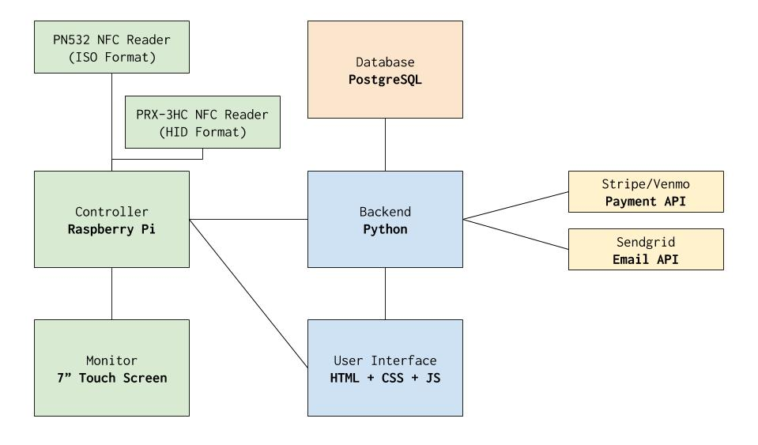

# Customized Raspberry Pi based Point Of Sale System 


## Purpose

Our goal is to develop an automated point of sale system using near field communications for the Bennington College campus thrift store (TAPA).
We hope that this POS system will help re-establish TAPA by easing the burden of managing inventory and potentially eliminating the expense of employing cashiers.

## High-level architecture



For more details, please visit the [design
doc](https://docs.google.com/document/d/1uPikHsPxjA35MsOq9hkEmXJNQbgH-Svp_8UPdOPB1fI/edit?usp=sharing).

## Installing

To install necessary development tools:
```
make init
```

## Using

First,
```
make db-setup && make run
```

Second, access
```
http://127.0.0.1:5000
```

## Developing

To setup postgres with pre-populated data. Used for initial setup and testing
mostly.
```
make db-setup
```

To run test
```
make test
```
